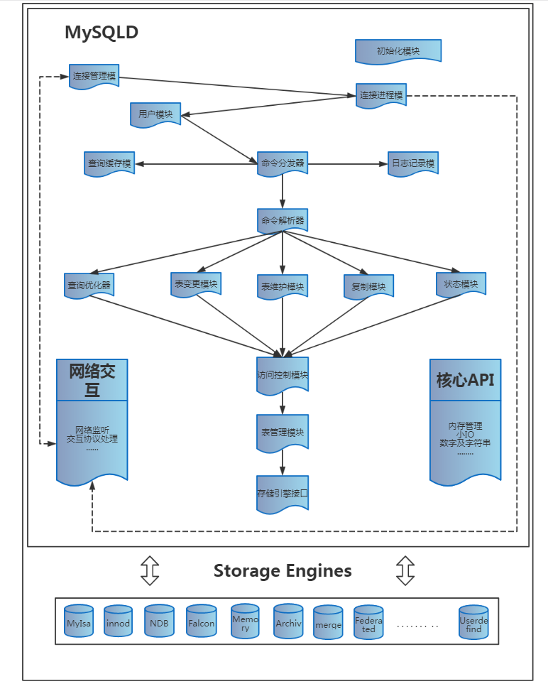

<!-- toc --> 

* * * * *

# 一、查询SQL执行流程

1.DB客户端发送SQL请求给DB服务端
2.DB服务端检查是否可以在查询缓存(QC)中命中
3.DB服务端进行SQL解析,预处理,再由优化器生成对应的执行计划
4.DB服务端Server层根据执行计划,调用存储引擎API来查询数据
5.DB服务端Server层将结果返回给客户端

# 二、相关工具
* 慢查询日志: slow.log
* 慢查询日志分析: pt-query-digest
* SQL执行计划分析: explain
* SQL耗时分析: show profile

# 三、SQL查询分析器explain使用说明

* select_type
    * simple，没有union或子查询
    * primary，嵌套中最外层 
    * union/union result/dependent union/dependent union
    * derived 衍生，导出，子查询产生临时表 
    * subquery 子查询第一个select语句
* type
    * const，最多一条，system 特例仅有一条
    * eq_ref，一种索引访问，仅返回1条，且索引为unique，primary
    * ref，返回多条，索引的是最左前缀，可以用于=<>
    * ref_or_null, 针对null
    * index_merger，索引合并优化
        * 5.1以后支持的，一个表可以使用多个索引
    * index intersect
    * unique_subquery，替换in子查询
    * index_subquery 替换in子查询
    * range，用index检索范围的行
    * index，全扫描索引
    * ALL
* Extra
    * Using filesort 
    	* 看到这个的时候，查询就需要优化了，MySQL需要进行额外的步骤来发现如何对返回的数据进行排序，它根据连接类型以及存储排序键值和匹配条件的全部行的行指针来排序全部行
    * Using temporary  
    	* 看到这个说也说明查询需要优化了，这里MySQL需要创建一个临时的表来存储结果，这通常发生在对不同的列集进行order by上，而不是group by上
count()和max()函数的优化
    * Not exists
    * Using index
    * Using index condition
    * Using where
* possible_keys
    * key 实际使用的索引
    * key_len，key的长度
    * ref 使用哪个列与key一起选择行
* key_len
	* 使用索引的长度，在不丢失精度的前提下，长度越短越好
* ref
	* 显示索引的那一列被使用了，如果可能的话，是一个常数
* rows
	* MySQL认为必须检查的，用来返回请求数的行数
 
# 四、优化方向
##  1.limit优化
当与order by 字段联合使用时，若排序字段有重复，需要增加排序列，否则数据会错
limit通常用于分布处理，时常会伴随order by从句使用，因此大多时候会使用filesort，这样会造成大量的IO问题

## 2.查询缓存
建议关闭查询缓存，使用redis等nosql来代替

## 3.join优化
* 确保on和using字句有索引，考虑关联顺序
* 索引where和排序冲突的时候，改成关联表方式或者子查询
* mysql5.6之前的一般需要改子查询为关联表
* 走索引不一定都快，区分度不够的索引可用考虑用复合索引
* 多值 max，改为group后max
* join 时要考虑类型一致，char型要考虑字符集一致，时间类型没走索引，要注意隐世转换
* select in 会被改写为exists，造成查询缓慢，可改成关联join查询
* 驱动表的选择，认清关联字段索引，可用straight_join验证猜想
* query cache并不适合更新，插入，删除非常大的应用
* group by，order by 只涉及表中一个列
* order by +limit 将limit，order by内嵌，限制join数量和保证index排序
* join时 尽量将条件内嵌，先过滤后join。
* 知道仅有一条时，用limit 1 限制
* not in或not exits 可转换为外连接或等值连接
* 某些情况下 or 可用用union all 或union 代替

## 4.排序优化
* 单表查询，若file sort 则可以用强制使用索引排序，或者用自关联方式
* 需要where+sort 或者多个sort 做联合索引，并考虑加上排序
* sort buffer
* 与group by 连用时 用order by null 禁用排序
* 别名 若和字段重复也会影响排序优化
* 索引长度导致不能优化
* 相关参数
    * A. sort_buffer_size 排序缓存
    * B. read_rnd_buffer_size 第二次排序缓存
    * C. max_length_for_sort_data 带普通列的最大排序约束
* file sort过程-普通&双路排序
    * 取出字段a和每行的物理id（tid），然后在sort_buffer_size 中排序
    * 根据排序好的tid从磁盘中拿到行数据，放到read_rnd_buffer_size中
* file sort过程-冗余单路排序
    * 区别是第一次是拿到所有相关数据而不只是TID，所以不用二次去磁盘取
* file sort 优化
    * 增加相关参数大小
    * 增强tempdir 指向的文件系统io

## 5.子查询优化
* 通常情况下，需要把子查询优化为join查询，但是在优化时需要注意关键键是否有一对多的关系，需要注意重复数据

## 6.其他：
* 所有的InnoDB表都设计一个无业务用途的自增列做主键，对于绝大多数场景都是如此，真正纯只读用InnoDB表的并不多，真如此的话还不如用TokuDB来得划算；
* 字段长度满足需求前提下，尽可能选择长度小的。此外，字段属性尽量都加上NOT NULL约束，可一定程度提高性能；
* 尽可能不使用TEXT/BLOB类型，确实需要的话，建议拆分到子表中，不要和主表放在一起，避免SELECT * 的时候读性能太差。
* 读取数据时，只选取所需要的列，不要每次都SELECT *，避免产生严重的随机读问题，尤其是读到一些TEXT/BLOB列；
* 对一个VARCHAR(N)列创建索引时，通常取其50%（甚至更小）左右长度创建前缀索引就足以满足80%以上的查询需求了，没必要创建整列的全长度索引；
* 通常情况下，子查询的性能比较差，建议改造成JOIN写法；
* 多表联接查询时，关联字段类型尽量一致，并且都要有索引；
* 多表连接查询时，把结果集小的表（注意，这里是指过滤后的结果集，不一定是全表数据量小的）作为驱动表；
* 多表联接并且有排序时，排序字段必须是驱动表里的，否则排序列无法用到索引；
* 多用复合索引，少用多个独立索引，尤其是一些基数（Cardinality）太小（比如说，该列的唯一值总数少于255）的列就不要创建独立索引了；
* 类似分页功能的SQL，建议先用主键关联，然后返回结果集，效率会高很多；
