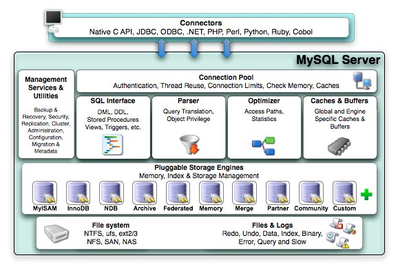

<!-- toc -->

* * * * *

# 一、MySQL体系架构

上图为官方提供的架构图

> 从图上看，可以看到分了两部分，对外的通用接口和内部结构。
> 内部主要分为两层：MySQL Server层 和 存储引擎层。而我们常说的MySQL体系结构其实就是内部这两层。

## 1.对外提供通用接口 Connectors

支持不同语言与 MySQL 的交互
```
mysql> show variables like '%connections%';
+----------------------+-------+
| Variable_name        | Value |
+----------------------+-------+
| max_connections      | 800   |
| max_user_connections | 0     |
+----------------------+-------+
2 rows in set (0.00 sec)
```
> max_connections：就是整个MySQL实例的最大连接数限制
> max_user_connections：是单个用户的最大连接数，这里未指明是哪个用户，是任意一个用户

```
经常会遇见”MySQL: ERROR 1040: Too many connections”的情况，一种是访问量确实很高，MySQL服务器抗不住，这个时候就要考虑增加从服务器分散读压力，另外一种情况是MySQL配置文件中max_connections值过小：
mysql> show variables like ‘max_connections‘;
+—————–+——-+
| Variable_name　　　 | Value |
+—————–+——-+
| max_connections | 256　　 |
+—————–+——-+
这台MySQL服务器最大连接数是256，然后查询一下服务器响应的最大连接数：
mysql> show global status like ‘Max_used_connections‘;
MySQL服务器过去的最大连接数是245，没有达到服务器连接数上限256，应该没有出现1040错误，比较理想的设置是
Max_used_connections / max_connections * 100% ≈ 85%
最大连接数占上限连接数的85％左右，如果发现比例在10%以下，MySQL服务器连接数上限设置的过高了。
```

## 2 MySQL Server层
MySQL Server层又分为连接层和SQL层。

### 2.1 连接层

* 为解决资源的频繁分配﹑释放所造成的问题，为数据库连接建立一个“缓冲池”。
* 预先在缓冲池中放入一定数量的连接，当需要建立数据库连接时，只需从“缓冲池”中取出一个，使用完后再放回去。
* 进行身份验证、线程重用、连接限制、检查内存、数据缓存。
* 管理用户的连接，线程处理等需要缓存的需求。

### 2.2 SQL层

SQL层主要有如下：
#### 2.2.1 SQL接口
* 进行DML、DDL，存储过程、视图、触发器等操作和管理；用户SQL命令接口

#### 2.2.2 解析器
* SQL命令传递到解析器的时候会被解析器验证和解析。解析器是由Lex和YACC实现的，是一个很长的脚本。
*  主要功能：
	- a . 将SQL语句分解成数据结构，并将这个结构传递到后续步骤，以后SQL语句的传递和处理就是基于这个结构的
	- b.  如果在分解构成中遇到错误，那么就说明这个sql语句是不合理的

#### 2.2.3 查询优化器
* 对SQL语句查询进行优化，“选取、投影和连接”
	  SQL语句在查询之前会使用查询优化器对查询进行优化。他使用的是“选取-投影-联接”策略进行查询。
    用一个例子就可以理解： select uid,name from user where gender = 1;
	  这个select 查询先根据where 语句进行选取，而不是先将表全部查询出来以后再进行gender过滤
	  这个select 查询先根据uid和name进行属性投影，而不是将属性全部取出以后再进行过滤将这两个查询条件联接起来生成最终查询结果

#### 2.2.4 缓存和缓冲区
* 由一系列小缓存组成的。比如表缓存，记录缓存，key缓存，权限缓存等。如果查询缓存有命中的查询结果，查询语句就可以直接去查询缓存中取数据。

主要注意几个参数：
```
mysql> show variables like '%query_cache%' ;
+------------------------------+---------+
| Variable_name                | Value   |
+------------------------------+---------+
| have_query_cache             | YES     |
| query_cache_limit            | 1048576 |
| query_cache_min_res_unit     | 4096    |
| query_cache_size             | 1048576 |
| query_cache_type             | OFF     |
| query_cache_wlock_invalidate | OFF     |
+------------------------------+---------+
6 rows in set (0.00 sec)
```

> 注意：
> 生产环境建议关闭query cache
> 关闭query cache只设置query_cache_size =0不启作用，要配合使用query_cache_type=OFF使用

### 2.3Management Serveices & Utilities
* 系统管理和控制工具：从备份和恢复的安全性、复制、集群、管理、配置、迁移和元数据等方面管理数据库

## 3.插件式存储引擎

MySQL的存储引擎是插件式的。它根据MySQL AB公司提供的文件访问层的一个抽象接口来定制一种文件访问机制，这种访问机制就叫存储引擎，目前常见的存储引擎见下：
* MyISAM：它查询速度快，有较好的索引优化和数据压缩技术。但不支持事务。
* InnoDB：  支持事务，并且提供行级的锁定，应用也相当广泛。
* BDB：不再从底层支持BDB
* Memory：适合存储临时数据
* Archive：适合存储历史数据

会在下一章再详细的介绍存储引擎（innodb）

物理文件层

* 支持的文件类型
	* EXT3、EXT4、NTFS、NFS
* 文件内容
  * 数据文件
  * 日志文件

## 4.MySQL物理存储结构

### 4.1 MySQL参数文件my.cnf

### 4.2 表结构的组成
* frm：表结构定义文件
* MYI：索引文件
* MYD：数据文件


### 4.3 错误日志

### 4.4 general 日志

### 4.5 慢查询日志

### 4.6 插件
