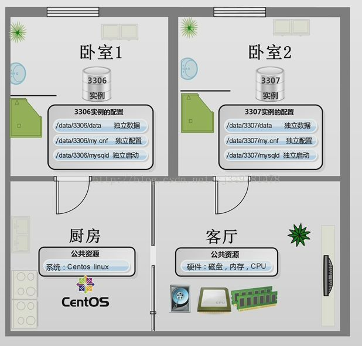

<!-- toc --> 
* * * * *

# 一、介绍
* mysql多实例，简单理解就是在一台服务器上，MySQL 服务开启多个不同的端口（如3306、3307），运行多个服务进程。这些 MySQL 服务进程通过不同的 socket来监听不同的数据端口，进而互不干涉的提供各自的服务。
* 在同一台服务器上，MySQL 多实例会去共用一套 MySQL 应用程序，因此你在部署 MySQL 的时候只需要部署一次 MySQL 程序即可，无需多次部署。但是，MySQL 多实例之间会各自使用不同的 my.cnf 配置文件、启动程序和数据文件。在提供服务方面，MySQL 多实例在逻辑上看起来是各自独立，互不干涉的，并且多个实例之间是根据配置文件的设定值，来获取相关服务器的硬件资源。

下面用一个比喻，来帮助大家理解 MySQL 多实例的本质。

* mysql 多实例相当于合租房，合租房里面有多个租客，每个租客都租有一个卧室，这个卧室就相当于 MySQL 的一个实例。整个合租房就相当于一台服务器。合租房里面的洗衣机、卫生间、阳台就相当于我们服务器上的各种硬件资源，比如CPU、MEM、DISK等，这些东西都是公共资源，大家共用的。
* 另外，多实例并不仅仅是 MySQL 才有，其实日常运维中碰到的很多服务都可以部署使用多实例，并且在生产环境中也非常热衷去使用，甚至在门户网站应用也很广泛，例如nginx多实例、apache多实例、redis多实例等等。

## 1.优缺点
### 优点：
* 有效利用服务器资源
	* 当单个服务器资源过剩时，可以充分利用剩余的资源来提供更多的服务
* 节约服务器资源
	* 当公司资金紧张，但数据库又需要数据库之间各自提供服务时，并且还想使用主从同步等技术，此时多实例就再好不过了
* 方便后期架构扩展
	* 当公司的某个项目才启动时，启动初期并不一定有很大的用户量，因此可以先用一组物理数据库服务器，在上面部署多个实例，方便后续架构扩展、迁移

### 缺点：
* 资源互相抢占问题
	* 当某个服务实例并发很高或者有慢查询时，整个实例会消耗更多的内存、CPU和IO资源，这将导致服务器上的其它实例提供服务的质量下降。这就比如说合租房的各个租客，每当早晨上班时，都会洗漱，此时卫生间的占用率就大，各个租客总会发生等待。

## 2.常见应用场景
* 当一个公司业务访问量不太大，又想节俭成本，并且还希望不同业务的数据库服务能够各自尽量独立，提供服务能够互相不受影响。另外还需要应用主从同步等技术来提供数据库备份或读写分离服务，以及方便后期业务量增大时，数据库架构的扩展和迁移。此时，Mysql 多实例就再好不过了。比如，我们可以通过在 3 台服务器部署 6-9 个实例，然后交叉做主从同步备份及读写分离，来实现 6-9 台服务器才能够达到的效果
* 公司业务访问量不是太大的时候，服务器的资源基本都是过剩状态。此时就很适合 Mysql 多实例的应用。如果对 SQL语句 优化做的比较好，Mysql 多实例 是一个很值得去使用的技术。即使后期业务并发很大，只要合理分配好系统资源，也不会有太大的问题
* 为了规避 Mysql 对 SMP 架构不支持的缺陷，我们可以使用 Mysql 多实例绑定处理器的办法（NUMA处理器必须支持，不过现在大部分处理器都支持的）将不同的数据库分配到不同的实例上提供数据服务；
* 传统游戏行业的 MMO/MMORPG以及Web Game，会将每个服都对应一个数据库，而且可能经常要做很多数据查询和数据订正工作。此时，为了减少维护而出错的概率，我们也可以采用多实例的部署方式，按区的概念来分配数据库。

## 3.MySQL多实例实现的3种方式
* 基于多配置文件
    * 通过使用多个配置文件来启动不同的进程，以此来实现多实例。
    * 优点：逻辑简单，配置简单
    * 缺点：管理起来不方便
* 基于mysqld_multi
    * 通过官方自带的 mysqld_multi 工具，使用单独配置文件来实现多实例
    * 优点： 便于集中管理管理
    * 缺点： 不方便针对每个实例配置进行定制
* 基于IM
    * 使用 MySQL 实例管理器（MYSQLMANAGER），这个方法好像比较好不过也有点复杂
    * 优点：便于集中管理
    * 缺点：耦合度高。IM一挂，实例全挂，不方便针对每个实例配置进行定制

# 二、部署演示
略